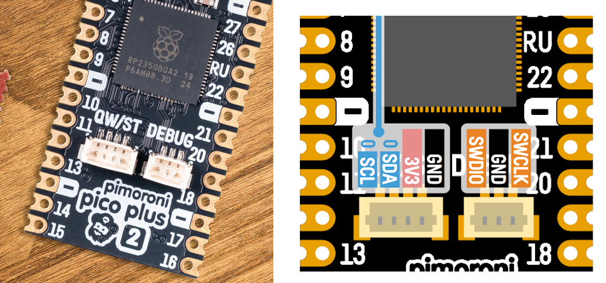

# PSRAM Bug project

## Description

Tries to find a bug in Arduino-Pico where PSRAM data is overwritten seemingly by the LittleFS implementation

## Prequisites
* Pimoroni Pico Plus 2 (board to be debugged)
* any RP2040 board, e.g. Raspberry Pi Pico (used as debugger)
* cables

## How to use

### Opening up this project

Prerequisites: 
1. Have Microsoft VSCode installed (<https://code.visualstudio.com/download>)
2. Have Git installed and available in your terminal

Procedure:
1. Enable Win32 long paths for Windows **and** git in accordance to [the docs](https://arduino-pico.readthedocs.io/en/latest/platformio.html#important-steps-for-windows-users-before-installing). This **needs** a reboot.
2. Install the "PlatformIO" extension in VSCode per [docs](https://docs.platformio.org/en/latest/integration/ide/vscode.html#installation).
3. Clone this repository and open the cloned folder in VSCode.
4. The first initialization process will take a long time (clones Arduino-Pico, the toolchain, etc.)
5. Once all loading bars have completed, use the PlatformIO sidebar -> Project Tasks -> Build. It should end with a green "SUCCESS". This means the firmware could be built successfully.

### Upload the program normally via USB

1. Plug in the RP2350 board via USB
2. Use the project tasks -> `pimoroni_pico_plus_2_regular` -> Upload and Monitor
3. Obseve output ("Data error" expected here)
4. Unplug the RP2350 board again

Note: If the `picotool` uploader cannot find a device to upload to, replug the RP2350 in BOOTSEL mode and use Zadig (<https://zadig.akeo.ie/>) to load WinUSB drivers for the "RP2350 Boot (Interface 1)" device.


### Prepare the Debugger

1. Go to https://github.com/raspberrypi/debugprobe/releases
2. When using a Raspberry Pi Pico (not the dedicated "Debugprobe" hardware), download `debugprobe_on_pico.uf2`
3. Plug in your Raspberry Pi Pico with the BOOTSEL button pressed. It should show up as a virtual UF2 harddrive
4. Drag an drop the `debugprobe_on_pico.uf2` into the virtual harddrive
5. The harddrive should disappear and the Windows device manager, when View -> Device by Container is chosen, should show a "Debugprobe in Pico" device


6. Unplug the Pico again.

### Connect the debugger to the RP2350 board

Adapted from <https://datasheets.raspberrypi.com/pico/getting-started-with-pico.pdf>. 

The Pimoroni sadly has slightly less accessible SWD pins than other boards. Specifically, we need the SWCLK and SWDIO signals (and common GND). These are located on a 3-pin JST-SH connector.



Whereas the Debugger has the following pinout


In total, the following connecitons must be made between the two Boards
```
Debugger (RP2040)  <--> Pimoroni Pico Plus 2 (RP2350)
GND  <-->  GND
GP2  <-->  SWCLK
GP3  <-->  SWDIO
GP4  <-->  GP1
GP5  <-->  GP0
```

Once all connections are made, first plug in the Debugger, then the Pimoroni Plus 2 via their respective USB cables. The debugger and the Pimoroni are each powered by their own USB cable and do not share power between them, only common GND.

### Testing Debugprobe upload

With the wiring done as in the chapter above and both the debugger and Pimoroni board plugged in, CMSIS-DAP upload should work.

First of all, switch to the Debugprobe environment.


Then use the sidebar -> project tasks -> `pimoroni_pico_plus_2_debugprobe` -> "Upload" to trigger an upload with the Picoprobe.

If everything went right, the Debugprobe (CMSIS-DAP) as well as the RP2350 should be discovered and flashed correctly.


### Starting a debug session

Use the debug sidebar and the play button next to "PIO Debug" to start a debug session.


With some luck, the debug session should startup (look at progress in the VSCode "Debug Console" tab) and the processor should halt in the `setup()` function.

